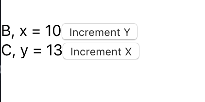

## Instructions for students:

### Create a Counter with redux and react

Instructions:

-   The user should be able to increment Y by 1 and display the result below for the corresponding Y. 

-   The user should also be able to increment X by 1 and display the result above for the corresponding X.

-   Start the project with create react app.

-   Use react-redux. 

-   Make a separate file for reducer.

-   Use separate components.

-   Here is an image for reference:

    

### Rules

-   This is an individual assignment.
-   Deadline: 1 hour.
-   Feel free to document your code with comments.
